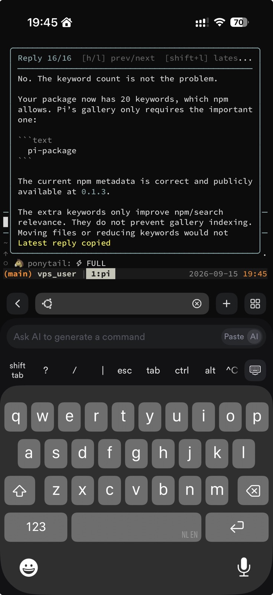
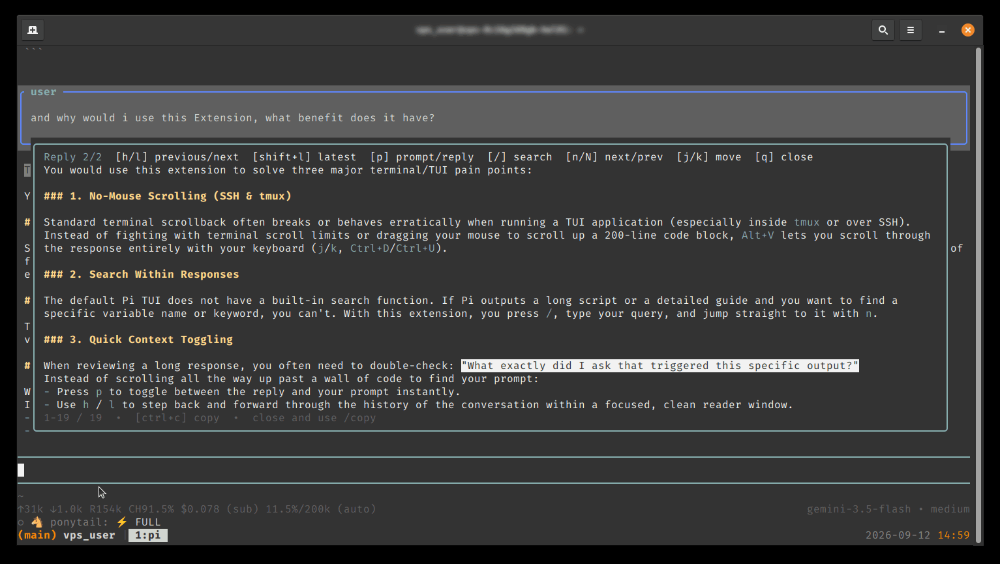
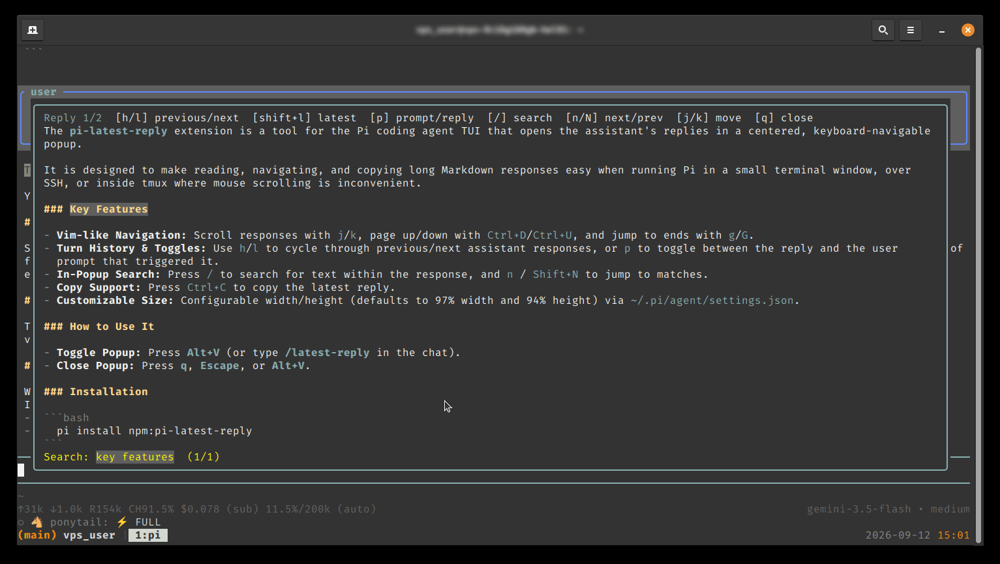

# pi-latest-reply

Pi Latest Reply puts your Pi conversation history one keystroke away. Open the current or previous assistant responses in a centered, readable popup with Markdown rendering, Vim-like navigation, instant search, and quick prompt/reply toggling. It’s built for the moments when terminal scrolling gets in the way—especially in compact windows, SSH sessions, and tmux—so you can revisit useful answers quickly without losing your flow. The extension stays intentionally focused on Pi and keyboard-first workflows, with copying limited to the latest reply, keeping the experience fast, focused, and refreshingly simple.

## Preview







## Install

From npm:

```bash
pi install npm:@kevinjel/pi-latest-reply
```

Or install directly from GitHub:

```bash
pi install git:github.com/kevinjelnl/pi-latest-reply
```

Or try a local checkout:

```bash
pi install /path/to/pi-latest-reply
```

Restart Pi, or run `/reload` if the extension is already installed.

## Usage

After Pi has produced a response, press:

```text
Alt+V
```

You can also open it with:

```text
/latest-reply
```

`Alt+V` toggles the popup: press it again while the popup is open to close it.

Pi's built-in `/copy` command continues to copy the complete latest assistant response, including its Markdown/code fences.

The popup renders Markdown with Pi's normal colors and uses a lightweight thinking-color border rather than an opaque fill.

The popup supports:

| Key | Action |
|---|---|
| `h` / `l` | Show the previous/next assistant response |
| `Shift+L` | Jump to the most recent response |
| `p` | Toggle between the current reply and its prompt |
| `/` | Start whole-word search |
| `n` / `Shift+N` | Next/previous match |
| `Ctrl+C` | Copy the latest reply; disabled on older replies |
| `j` / `k` | Move down/up one line |
| `Ctrl+D` / `Ctrl+U` | Move down/up by a page |
| `g` | Jump to the beginning |
| `G` | Jump to the end |
| `PageUp` / `PageDown` | Scroll by a page |
| `q` / `Escape` / `Alt+V` | Close the popup |

The border follows the currently selected Pi thinking level (`thinkingLow`, `thinkingMedium`, `thinkingHigh`, etc.). The popup keeps user prompts and textual assistant replies from the active session branch, so previous turns remain available while Pi is running. Press `p` to toggle the selected turn between its prompt and reply. Copying is intentionally limited to the latest reply; `/copy` remains Pi's built-in command.

## Keybindings

The defaults are stored in `~/.pi/agent/keybindings.json` and can be changed there:

```json
{
  "pi.latestReply.open": "alt+v",
  "pi.latestReply.close": "q",
  "pi.latestReply.previous": "h",
  "pi.latestReply.next": "l",
  "pi.latestReply.latest": "shift+l",
  "pi.latestReply.prompt": "p",
  "pi.latestReply.copy": "ctrl+c",
  "pi.latestReply.search": "/",
  "pi.latestReply.searchNext": "n",
  "pi.latestReply.searchPrevious": "shift+n"
}
```

Run `/reload` after changing them.

## Popup size

The default popup uses 97% of the terminal width and 94% of its height. Adjust it in `~/.pi/agent/settings.json`:

```json
{
  "piLatestReply": {
    "width": "97%",
    "maxHeight": "94%"
  }
}
```

Values may be percentages or terminal-cell numbers. Run `/reload` after changing them.

The response viewer is intentionally read-only; editing a response would turn it into a separate document rather than a conversation viewer.

The response is captured from Pi's finalized `message_end` event. It is not written to a separate temporary Markdown file.

## Configuration

The shortcut defaults to `Alt+V` and is configurable through the `pi.latestReply.*` entries shown above.

Pi's normal editor binding for `Ctrl+U` can be disabled separately in `~/.pi/agent/keybindings.json`:

```json
{
  "tui.editor.deleteToLineStart": []
}
```

## Terminal notes

- The popup is an overlay, so it works in regular and fullscreen Pi TUI modes.
- Pi must receive `Alt+V`; terminal and tmux key mappings can intercept modified keys.
- The viewer is read-only. Search is intentionally lightweight: `/` starts a case-insensitive whole-word search, `n`/`Shift+N` cycle matches, and `Escape` cancels search without closing the popup. Moving between replies with `h`/`l` exits search and clears its highlights so stale matches cannot carry over. It does not attempt to implement full Vim counts or modes.
- Copying deliberately uses Pi's exported clipboard utility; it does not duplicate Pi's `/copy` command.
- `/latest-reply` is useful for testing when a terminal or tmux setup intercepts `Alt+V`.

## Development

The extension is a single TypeScript file:

```text
extensions/latest-reply.ts
```

Pi provides `@earendil-works/pi-coding-agent` and `@earendil-works/pi-tui` when loading extensions, so they are listed as peer dependencies rather than bundled into this package.

## Package metadata

This repository is a Pi package: `package.json` declares the `pi-package` keyword and the `pi.extensions` manifest used by Pi's package gallery. The npm package is published as `@kevinjel/pi-latest-reply`. The npm package contains the README, license, manifest, extension, and these two screenshots. It contains no credentials, project-local settings, recordings, or generated session data.

The GitHub source repository is also available for review and direct installation.
